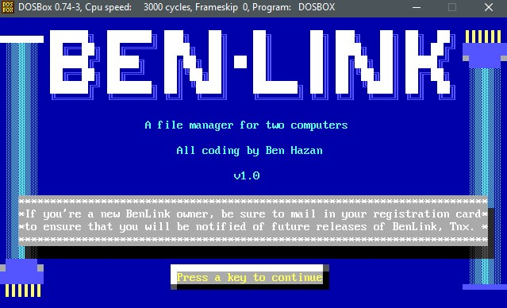
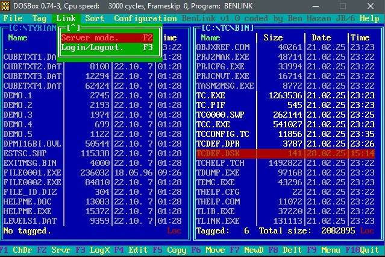

# ben-link

My high-school project from 1999 - a DOS commander with null-parallel cable file transfer capability

Please note that this code was written during my high school years in 1999, so the code quality and practices reflect my programming experience at that time. While it may not follow modern best practices, I'm sharing it for historical interest and preservation.

This tool allows DOS users to:

- Browse and manage files in a Commander-style interface
- Transfer files between two computers using a null parallel cable (useful when you don't have a network card or USB)
- Perform basic file operations (copy, move, delete, etc.)

I hope this tool can still be useful for DOS users looking to backup their vintage computers or transfer files between old machines.

## Screenshots

## Compilation

Using dosbox, and Turbo C++ 3.0.

## License

This project is licensed under the MIT License. See the LICENSE file for details.
